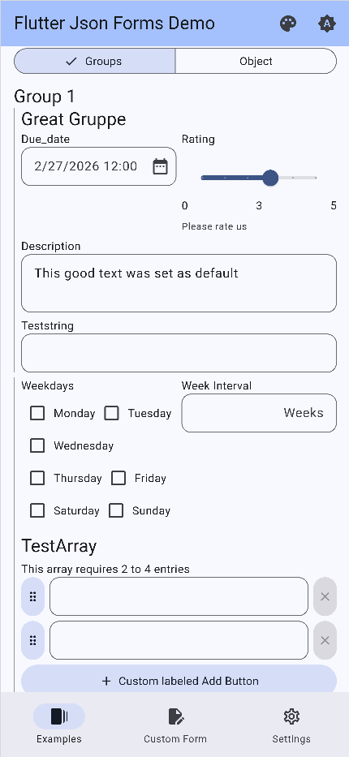
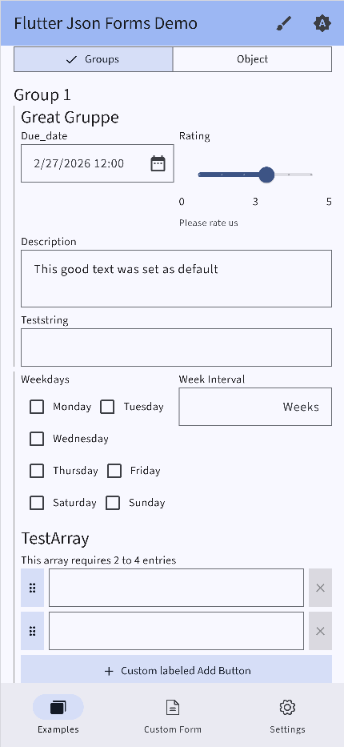
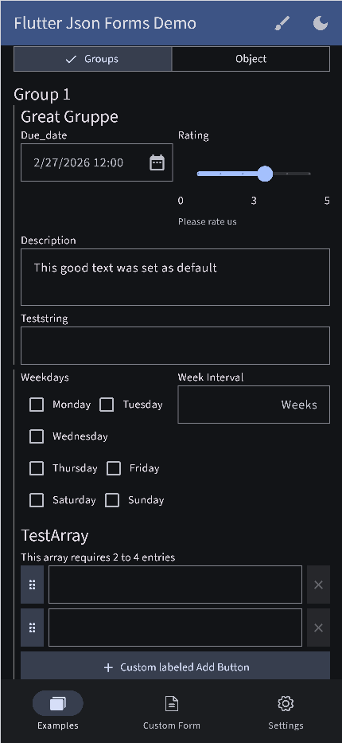
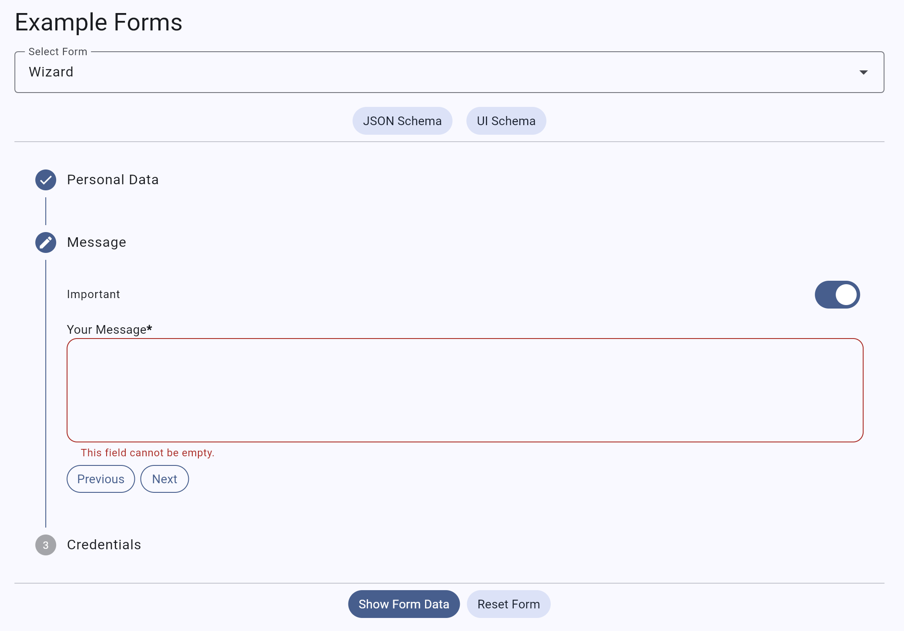

<!--
This README describes the package. If you publish this package to pub.dev,
this README's contents appear on the landing page for your package.

For information about how to write a good package README, see the guide for
[writing package pages](https://dart.dev/guides/libraries/writing-package-pages).

For general information about developing packages, see the Dart guide for
[creating packages](https://dart.dev/guides/libraries/create-library-packages)
and the Flutter guide for
[developing packages and plugins](https://flutter.dev/developing-packages).
-->

# Flutter Json Form

A form renderer which automatically creates highly customizable forms based on json input. An Json schema as of [Draft-07](https://json-schema.org/draft-07) has to be provided for the structure of the form and an optional [Ui Schema](https://educorvi.github.io/vue-json-form/ui-schema/) can be set to customize the appearance of the form. This allows defining dynamic dependencies like the visibility of fields depending on the value of other fields.

A [Demo](https://educorvi.github.io/flutter_json_form/) of `flutter_json_form` exists to play around with the functionality and debug own schemas.

## Features

### Overview

- Automatically create rich forms based on json schema ([Draft-07](https://json-schema.org/draft-07))
- Customize the visual appearance and dynamic dependencies between form elements with an optional [Ui Schema](https://educorvi.github.io/vue-json-form/ui-schema/)
- Automatically handles form validation based on the json schema
- Submitted form data is represented in json for easy processing

### Theming

The form elements are based on Material 3 widgets and therefore inherit theming from the app's theme like Icons, Font, Colors, Boarder etc.

| | | |
|---|---|---|
|  |  |  |

__Note__: In the future it is also planned to further customize element theming like array and object renderings which are currently hard coded widgets in the form renderer itself. It is planned to support this in different steps where you can first customize simple things like paddings of elements or the icon for specific elements but for more control you can also provide custom builder methods to render completely custom widgets. The same is planned for the elements itself by providing own widget builders for the different form elements like simple text fields, time pickers etc. where the renderer abstracts away the logic on when which element to load and things like onSaved callbacks but they can be further customized by the user.

### Dynamic dependencies

A common use case for forms is to show or hide fields based on the value of other fields. This can be easily achieved by providing a Ui Schema with `showOn` conditions for the specific fields. The form renderer will then automatically evaluate these conditions and show or hide the fields accordingly. This also works for elements within objects and also array elements can have dependencies on other fields either within an array or outside of it.

TODO demo:

### And more...

The form_renderer supports a variety of features like objects and array that can be nested within each other as often as needed, a variety of input elements like color pickers, time range pickers, file uploads and so on, a wizard mode to split the form into multiple steps and much more. The [demo](https://educorvi.github.io/flutter_json_form/) contains a lot of examples to play around with the functionality and test your own schemas.



## Getting started

To use the form renderer you need a valid json schema as of ([Draft-07](https://json-schema.org/draft-07)) to define the form. The [Ui Schema](https://educorvi.github.io/vue-json-form/ui-schema/) is optional and gets generated automatically if not provided but to further customize the form and define dynamic dependencies between fields, you have to generate your own Ui Schema.

To use the package, add it to your `pubspec.yaml` file:

```yaml
dependencies:
  flutter_json_form: ^0.0.1
```

Then, run `flutter pub get` to install the package.

### Usage

The form renderer can be used like this:

```dart
import 'package:flutter/material.dart';
import 'package:flutter_json_form/flutter_json_form.dart';

void main() {
  runApp(
    FlutterJsonFormsDemo()
  );
}

class FlutterJsonFormsDemo extends extends StatelessWidget {
  final GlobalKey<FlutterJsonFormState> formKey;

  FlutterJsonFormsDemo({super.key}):
        formKey = GlobalKey<FlutterJsonFormState>();

  @override
  Widget build(BuildContext context) {
    return Scaffold(
      body: FlutterJsonForm(
        key: formKey,
        jsonSchema: {...},
        uiSchema: {...},
        validate: false,
        formData: {...},
      ),
    );
  }

```

Example values for the `jsonSchema`, `uiSchema` and `formData` can be seen here:

<details>
  <summary>Register Form</summary>

```dart
  jsonSchema = {
      "name": "registration",
      "title": "Registration",
      "type": "object",
      "description": "A simple registration form example",
      "$schema": "http://json-schema.org/draft-07/schema#",
      "properties": {
          "firstName": {
              "type": "string",
              "title": "First Name"
          },
          "lastName": {
              "type": "string",
              "title": "Last Name"
          },
          "newsletter": {
              "type": "boolean",
              "default": true,
              "title": "Sign up for newsletter"
          },
          "email": {
              "type": "string",
              "title": "Email",
              "format": "email"
          }
      },
      "required": [
          "firstName",
          "lastName"
      ]
  };

  uiSchema = {
      "version": "2.0",
      "$schema": "ui.schema.json",
      "layout": {
          "type": "Group",
          "options": {
              "label": "Registration"
          },
          "elements": [
              {
                  "type": "HorizontalLayout",
                  "elements": [
                      {
                          "type": "Control",
                          "scope": "#/properties/firstName",
                          "options": {
                              "placeholder": "First Name"
                          }
                      },
                      {
                          "type": "Control",
                          "scope": "#/properties/lastName",
                          "options": {
                              "placeholder": "Last Name"
                          }
                      }
                  ]
              },
              {
                  "type": "Control",
                  "scope": "#/properties/newsletter",
                  "options": {
                      "label": "Sign up for newsletter"
                  }
              },
              {
                  "type": "Control",
                  "scope": "#/properties/email",
                  "showOn": {
                      "path": "#/properties/newsletter",
                      "type": "EQUALS",
                      "referenceValue": true
                  },
                  "options": {
                      "placeholder": "Email address",
                      "format": "email"
                  }
              },
              {
                  "type": "Button",
                  "buttonType": "submit",
                  "text": "Sign Up",
                  "options": {
                      "variant": "primary"
                  }
              }
          ]
      }
  };

  formData = {
      "firstName": "John",
  };

```

</details>

The formData can be set to prefill the form with existing data. If not provided, the form will be empty (except default values are set in the json schema). For more extensive examples, check the [example](./exampe) directory or the [demo application](TODO).

<!-- ## Additional information

TODO: Tell users more about the package: where to find more information, how to
contribute to the package, how to file issues, what response they can expect
from the package authors, and more. -->

## Development

To read more about the development process, check out the [development guide](./doc/development.md).

## Roadmap

The following features are currently planned for the future:

- appearance of form renderer elements like arrays objects and single elements can be easily themed by providing a custom Theme object
- Customization: completely provide own widgets for the elements
- logic of the renderer can be further customized by providing callback functions
- ui schema is constantly expanded with more features to allow more customization of forms
