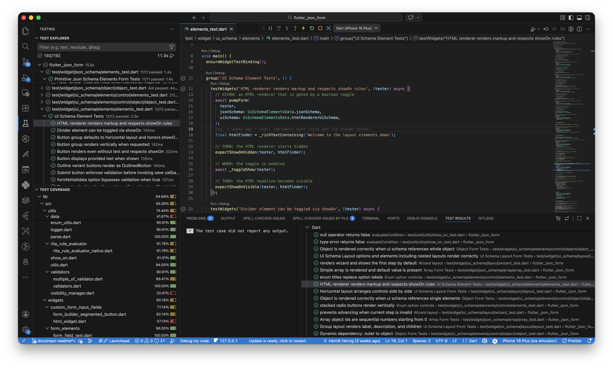
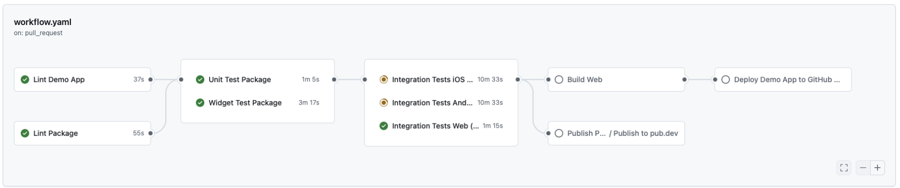

# Development

This document provides information on how to get started with development of the package, how to run tests and how to contribute to the package.

## Quick Start

First, make sure you have Flutter installed on your machine. You can check your installation by running `flutter doctor`.

The next step is to clone the repository to your local machine. It is recommended to use an IDE like [Visual Studio Code](https://code.visualstudio.com/) or [Android Studio](https://developer.android.com/studio) for development and install the corresponding Flutter and Dart plugins.

Afterwards, open the project and run `make install` to install the dependencies. This runs `flutter pub get` in both the root and the `demo` folder. The demo folder contains a simple demo application to test the form renderer and play around with it which makes it easier to develop and test new features. In order to run the demo application, simply run `make run-demo` from the root of the project which runs `flutter run` in the demo folder.

An Devcontainer configuration will be provided in the future to make it easier to get started with development.

## Quality

It is recommended to configure your IDE to automatically format the code on and analyze the code for potential issues. When installing the Flutter Extension, this should already be set up for you. You can also run `make lint-all` to format the code and `make format-all` to analyze the code for potential issues manually.

Concerning tests, there exist unit tests, widget tests and integration tests where integration tests are the same code as widgets tests with the difference that they are directly run on a device or emulator and not in a test environment.

For the package itself, unit and widgets tests are integration.

```bash
# run individual tests
make test-package-unit
make test-package-widget
make test-package-integration

# run all tests
make test-package-all
```

For the demo application, there exist only a simple integration test (smoke test) which can be run with:

```bash
make test-demo-integration
```

This just verifies the demo applications loads successfully and a form is rendered.

Additional make file targets exist to run the tests with coverage reporting for the CI/CD pipeline.

All tests can also be debugged using the testing panel of the IDE to debug tests and also see the results of past and current tests runs as well as run the tests with coverage reporting and seeing the results interactively in the IDE.




## CICD (GitHub Actions)

GitHub Actions workflows exist to run code quality checks, tests, deployments and releasing automatically. On every commit the code gets checked for formatting and linting. Unit and widget tests are also run on every commit and pull request. On pull requests and runs on main, tests are run on iOS and Android Emulators as well as on the Web to verify functionality on all platforms. A commit on main after a merge triggers a new deployment of the demo application using GitHub Pages. When the main branch is merge to release branches, a new release is automatically created and published to pub.dev. This depends on the semantic versioning of the commit messages.


